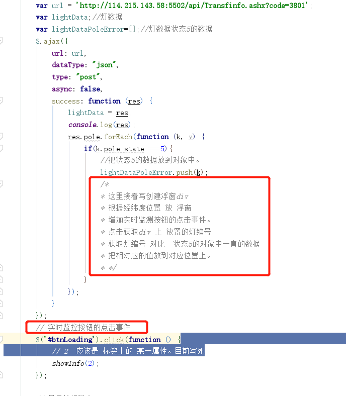

- [x] 整体分辨率，默认1920*1080
- [x] 去掉顶部信阳市定位，整体向上移动，适当拉高地图
- [x] 地图中，空气污染报警与路灯报警交互出现错误
- [x] 缺少浮窗，鼠标放置在地图的图标中，显示浮窗。
- [] [对接现有灯联网接口](#对接现有灯联网接口)
- [x] 地图缩放功能

# 对接现有灯联网接口

http://123.56.143.140:8090/pages/viewpage.action?pageId=4227247

sunfang
!password1

 [index.html](docs/信阳项目数据对接/static/index.html)

http://114.215.143.58:5502/api/Transfinfo.ashx?code=3801  接口 
